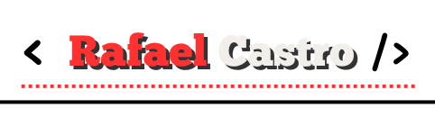
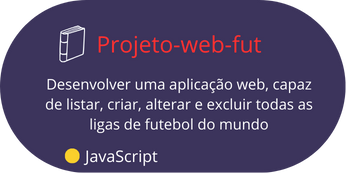
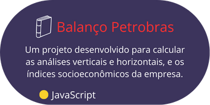
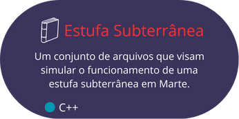

👋 Heyyy! I'm Rafael Castro, a brazilian front-end developer.

## About me

* Rafael Castro, 22 years
* Front-end Programmer
* Currently studying C# for game development
* 3 Years, 6 Months and 13 Days since I started programming

## **Skills wall:**

## **Recent projects:**

<!-- teste permissão -->
